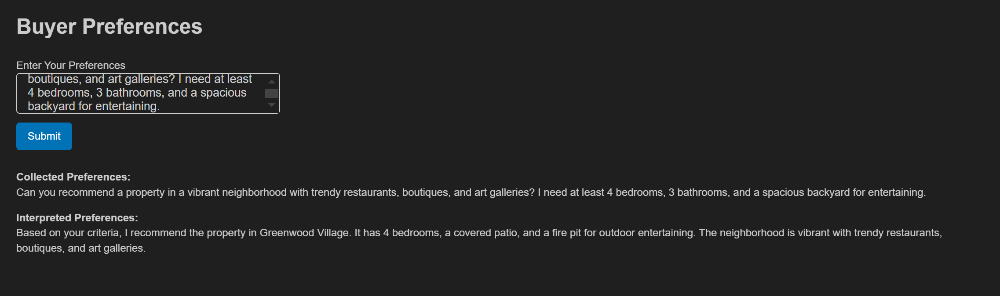
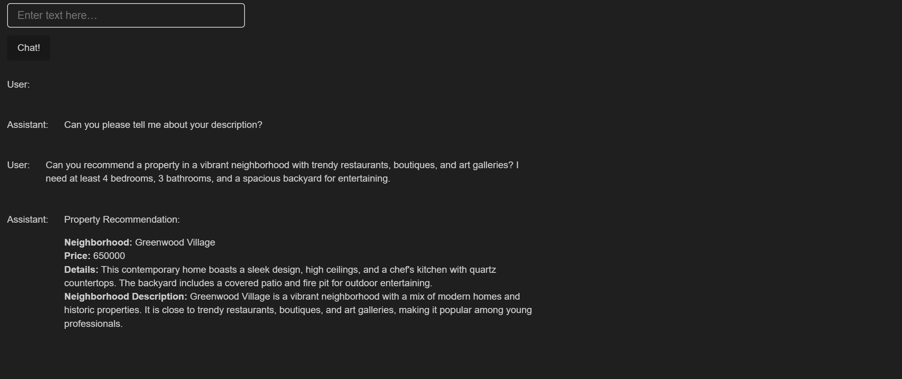

# Build Personalized LLM Real State Agent using Vector Database (ChromaDB)

## Project Overview

This project demonstrates how to build a personalized LLM (Language Learning Model) Real Estate Agent using a Vector Database. The implementation is provided in the `sample.ipynb` Jupyter notebook.

## Getting Started

### Prerequisites

- Python 3.x
- Jupyter Notebook
- Required Python libraries (listed in `requirements.txt`)


### Usage

1. Alternative 1 
    - Run the `sample.ipynb` Jupyter notebook to build a personalized LLM Real Estate Agent using a Vector Database.
    - The notebook provides an interactive interface where the potential customer can provide a query and the LLM Real Estate  
      Agent will provide the most relevant results based on the query and the vector database.
    - Refer to `results/layout.html` for the layout of the results.

      

2. Alternative 2
    - Run the `sample.ipynb` Jupyter notebook to build a personalized LLM Real Estate Agent using a Vector Database.
    - Extend the first alternative by amending the ```prefereces_collected``` dictionary below. This gives you the option to 
      gather specific information from the customer and provide personalized recommendations based on the customer's preferences.
    - Refer to `results/dashboard.html` for the layout of the results.

      ```
      preferences_collected = {
          # 'location': False,
          # 'price': False,
          # 'property_type': False,
          # 'size': False,
          # 'amenities': False,
          # 'style': False,
          'description': False
      }
      ```
      


